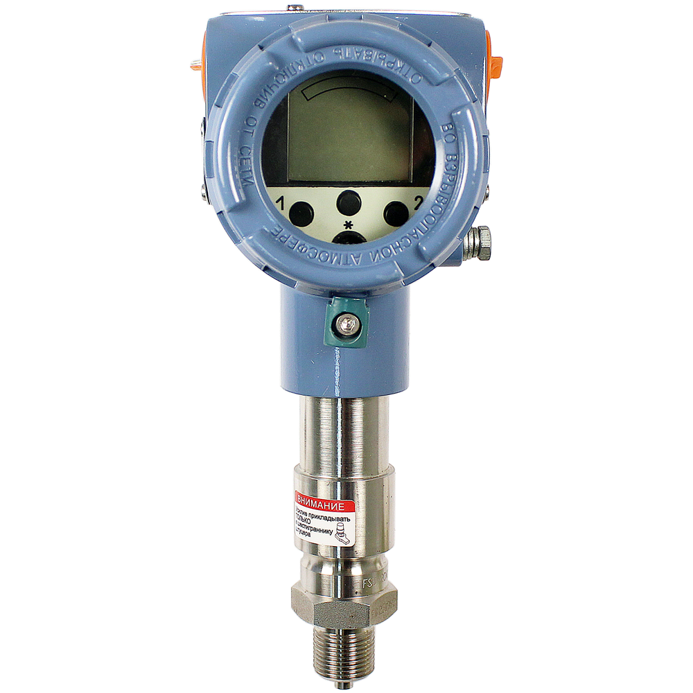
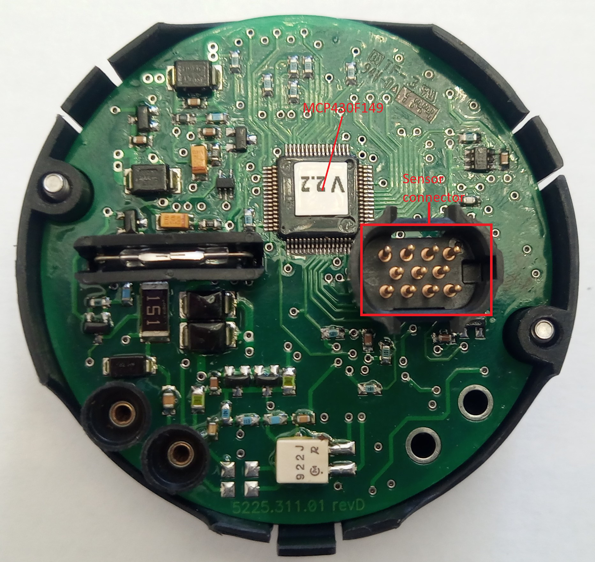
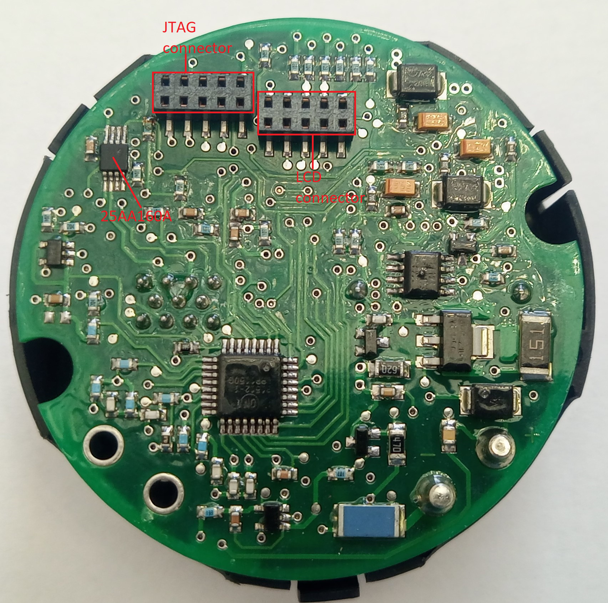
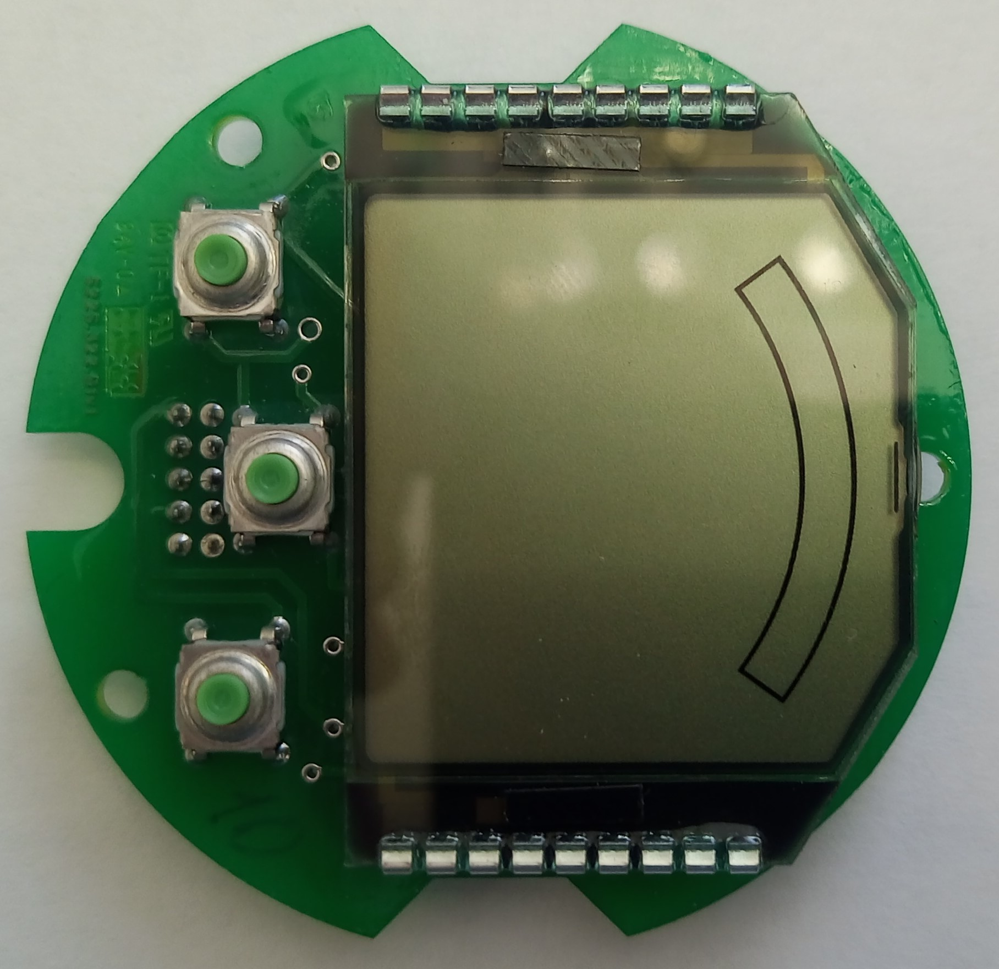
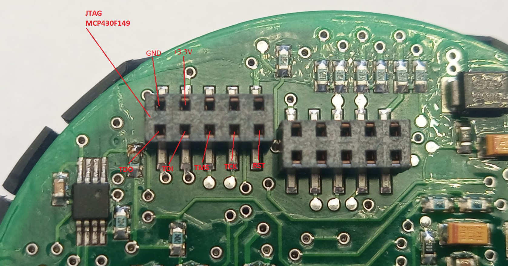

# METRAN-150

MCU - MCP430F149
SPI EEPROM - 25AA160A

Reading data from EEPROM see the following
- https://github.com/lepik/metran/metran-150/eeprom/

Figure - 1 - General form
&nbsp;

Figure - 2 - Circuit board from MCU side
&nbsp;

Figure - 3 - Circuit board from HART, EEPROM side 
&nbsp;

Figure - 4 - Circuit board from LCD side 
&nbsp;

Figure - 4 - Circuit board LCD from other side 
&nbsp;

Figure - 5 - MCU JTAG 
&nbsp;
