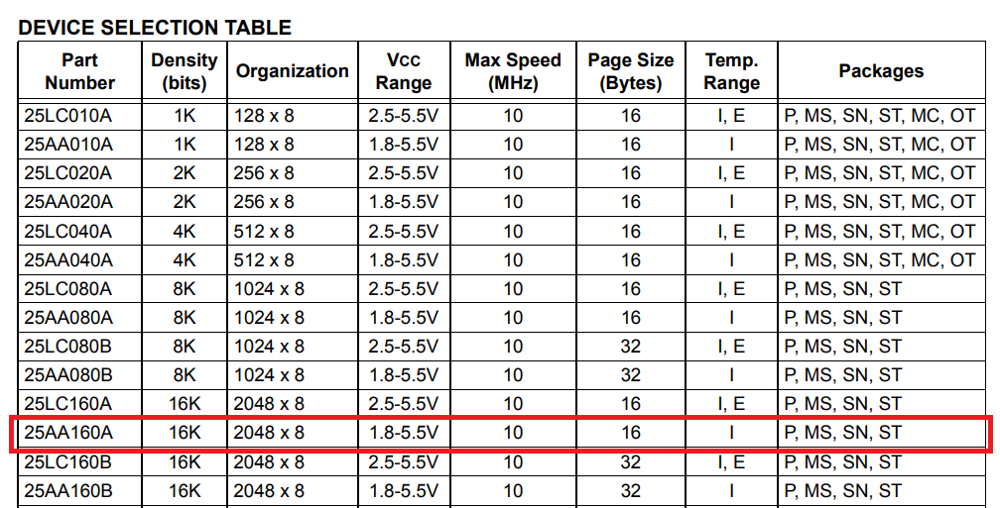
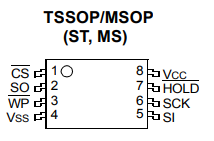
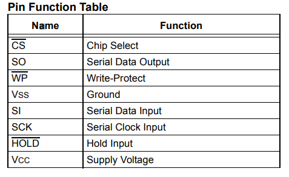
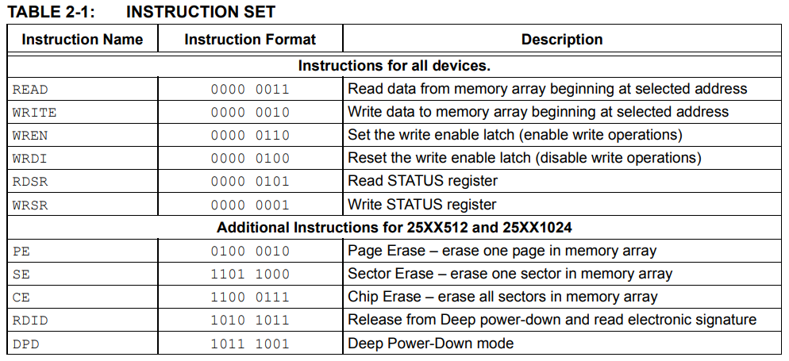
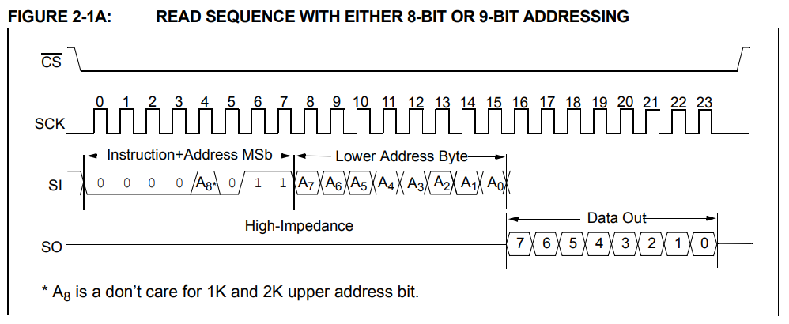
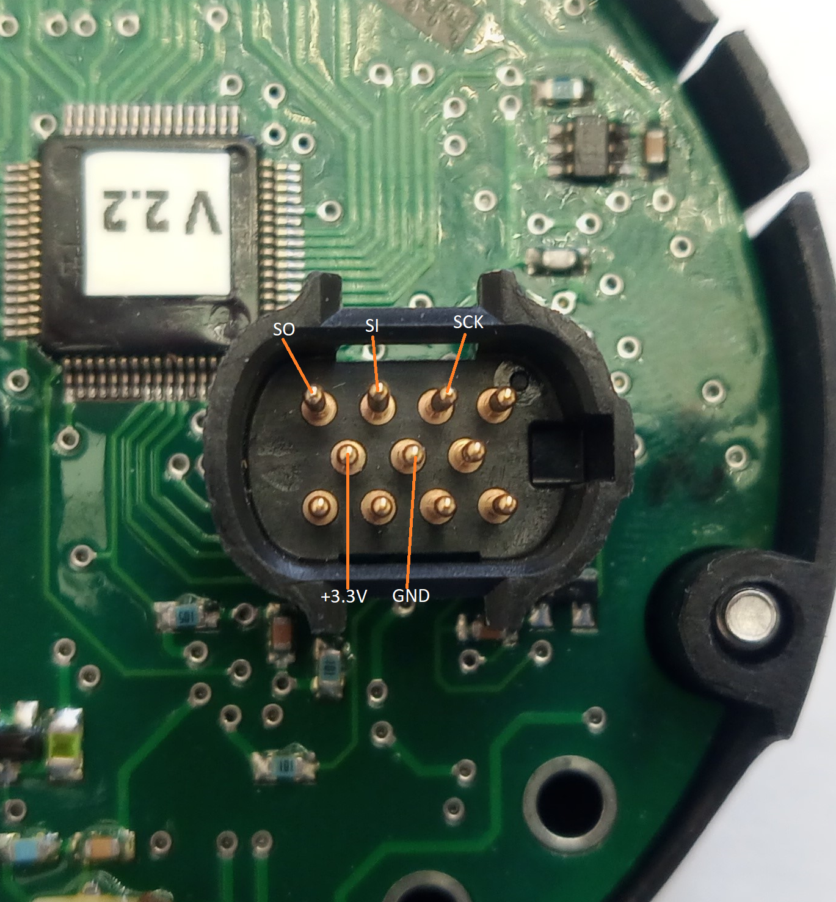
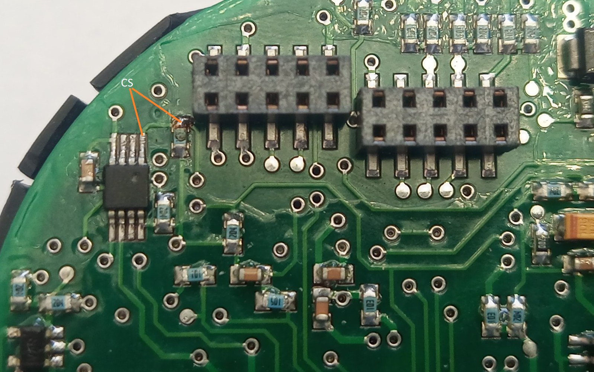
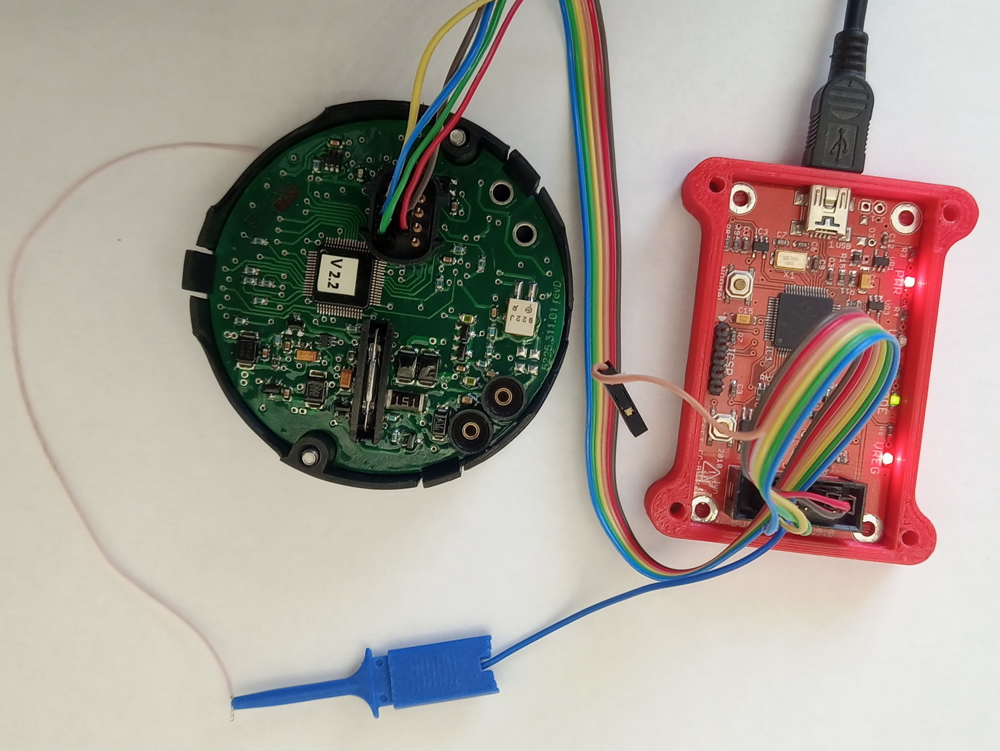
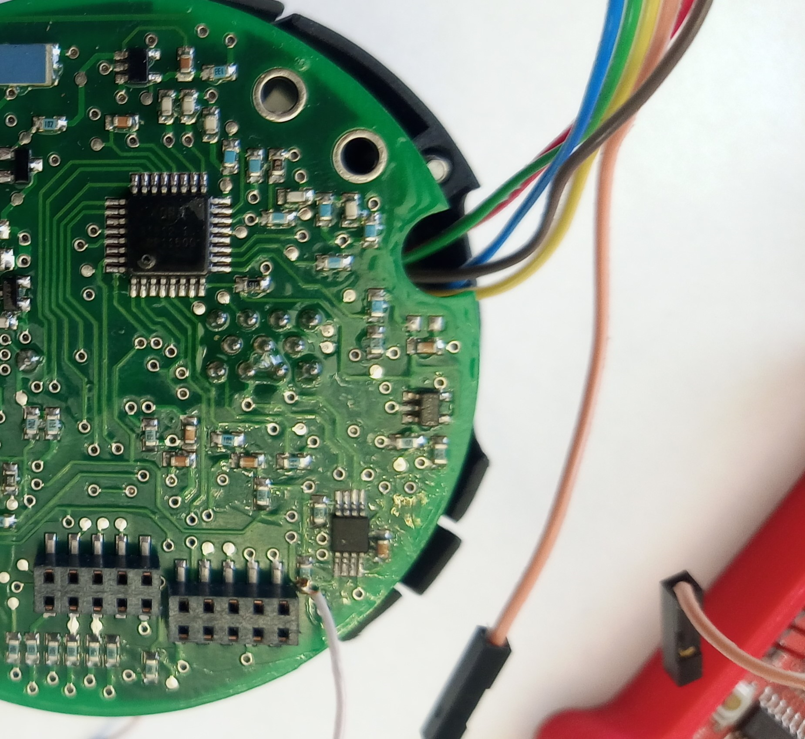

# EEPROM METRAN-150

You can use an SPI programmer to read the memory. I used [BusPirate](http://dangerousprototypes.com/docs/Bus_Pirate). 
The connection of the programmer is described in the figures below. 
To connect to the CS pin, you will need to solder to the chip pin.
I wrote utilities to take a full memory dump and to read just the password using BusPirate.

The password is stored in memory at the following addresses:

  - 0x4A: 1-first digit
  - 0x4B: 2nd digit
  - 0x4C: 3rd digit
  - 0x4D: 4th digit

## Script Usage
  - **dump_psw.py** is used to read user password from EEPROM.
  - **dump_all_eeprom.py** is used to dump everything from the EEPROM chip into a single binary file.
  - **bindiff.py** is used to compare binary files and display differences.

## Wiring Diagram

## Microchip 25AA160A

Figure - 1 - Microchip 25AA160A  characteristics

Figure - 2 - Microchip 25AA160A Pinout
&nbsp;

Figure - 3 -Microchip 25AA160A pin function
&nbsp;

Figure - 4 - Microchip 25AA160A instructions
&nbsp;

Figure - 5 - Microchip 25AA160A read operation
&nbsp;

Figure - 6 - Connecting the programmer to the sensor connector
&nbsp;

Figure - 7 - Connecting the programmer to chip to the CS pin
&nbsp;

Figure - 8 - Connecting BusPirate sensor connector
&nbsp;

Figure - 9 - Connecting BusPirate CS pin
&nbsp;

